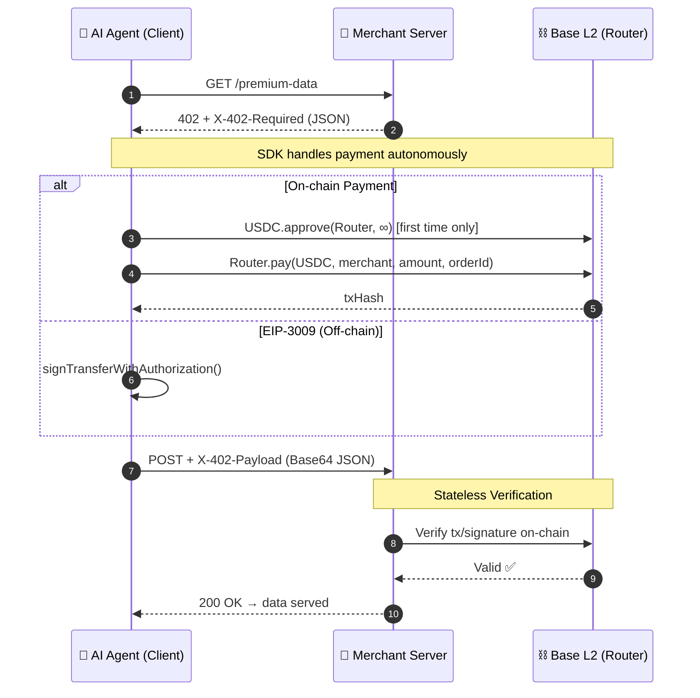

# The x402 Protocol

The core of PayNode is an extension of the HTTP `402 Payment Required` status code. We call this implementation **x402**.

The protocol defines a standardized handshake between a **Merchant Server** (API provider) and an **AI Agent** (Client).

---

## 🤝 The Handshake Flow



### 1. The Challenge (Server → Agent)

When an Agent requests a protected resource without prior payment, the server responds with HTTP `402` and includes a JSON discovery payload in the `X-402-Required` header (Base64 encoded):

```http
HTTP/1.1 402 Payment Required
X-402-Required: eyJ4NDAyVmVyc2lvbiI6MiwiZXJyb3IiOiJQYXltZW50IFJlcXVpcmVkIGJ5IFBheU5vZGUiLCJyZXNvdXJjZSI6eyJ1cmwiOiJodHRwczovL2FwaS5tZXJjaGFudC5jb20vcHJlbWl1bS1kYXRhIiwiZGVzY3JpcHRpb24iOiJQcmVtaXVtIERhdGEifSwiYWNjZXB0cyI6W3sic2NoZW1lIjoiZXhhY3QiLCJ0eXBlIjoiZWlwMzAwOSIsIm5ldHdvcmsiOiJlaXAxNTU6ODQ1MyIsImFtb3VudCI6IjEwMDAwMCIsImFzc2V0IjoiMHg4MzM1ODlmQ0Q2ZURiNkUwOGY0YzdDMzJENGY3MWI1NGJkQTAyOTEzIiwicGF5VG8iOiIweE1lcmNoYW50V2FsbGV0Li4uIiwibWF4VGltZW91dFNlY29uZHMiOjM2MDAsImV4dHJhIjp7Im5hbWUiOiJVU0RDIiwidmVyc2lvbiI6IjIifX1dfQ

Content-Type: application/json
```

The decoded JSON structure:

```json
{
  "x402Version": 2,
  "error": "Payment Required by PayNode",
  "resource": {
    "url": "https://api.merchant.com/premium-data",
    "description": "Premium Data"
  },
  "accepts": [
    {
      "scheme": "exact",
      "type": "eip3009",
      "network": "eip155:8453",
      "amount": "100000",
      "asset": "0x833589fCD6eDb6E08f4c7C32D4f71b54bdA02913",
      "payTo": "0xMerchantWallet...",
      "maxTimeoutSeconds": 3600,
      "extra": {
        "name": "USDC",
        "version": "2"
      }
    }
  ]
}
```

> **Important**: `amount` always uses the token's **smallest unit** (atomic unit). For USDC (6 decimals), `100,000` represents **$0.10**. The SDK supports two payment types:
> - `eip3009`: Off-chain signature (fastest, ~50ms)
> - `onchain`: Traditional on-chain transaction (~2s)


### 2. The Execution (Agent)

The SDK intercepts the `402`, parses the `X-402-Required` JSON, and:

**For EIP-3009 (recommended):**
1. Signs a `TransferWithAuthorization` message off-chain
2. No gas needed from the agent wallet

**For On-chain:**
1. Checks balance and allowance
2. Calls `Router.pay(token, merchant, amount, orderId)` on Base L2
3. Waits for confirmation (~2 seconds)

### 3. The Proof (Agent → Server)

The Agent retries the original request with a Base64-encoded JSON payload:

```http
POST /premium-data HTTP/1.1
Content-Type: application/json
X-402-Payload: eyJ2ZXJzaW9uIjoiMy4xIiwidHlwZSI6Im9uY2hhaW4iLCJvcmRlcklkIjoiYWdlbnRfanNfMTcxNjAwMDAwMCIsInBheWxvYWQiOnsidHhIYXNoIjoiMHg3MjQ5ZDUyNTVkOT..."
X-402-Order-Id: agent_js_1716000000
```

The decoded payload structure:

```json
{
  "version": "3.1",
  "type": "onchain",
  "orderId": "agent_js_1716000000",
  "payload": {
    "txHash": "0x7249d5255d916c9bd0c2eed128e850d1950d76f571c576048f6cd03c8c2e83da"
  }
}
```

### 4. Stateless Verification (Server)

The merchant's `PayNodeVerifier` (built into the middleware) uses the unified `verify()` method:

```typescript
const result = await verifier.verify(unifiedPayload, {
  merchantAddress: '0xMerchantWallet...',
  tokenAddress: '0xUSDCAddress...',
  amount: '100000',
  orderId: 'agent_js_1716000000'
});
```

Verification checks:
1. ✅ Does the txHash/signature exist and is valid?
2. ✅ Did it target the official PayNode Router contract?
3. ✅ Was the correct merchant address in the event?
4. ✅ Was the amount ≥ required price?
5. ✅ Is the token in the [accepted whitelist](/integration#token-whitelist)?
6. ✅ Is the chainId correct? (cross-chain replay protection)
7. ✅ Has this payload been used before? (idempotency check)

If all checks pass → `200 OK`. No database needed.

---

## 🛡️ Security Considerations

### Replay Attacks

The SDK includes `IdempotencyStore` (in-memory or Redis) to track consumed txHashes. A hash is only valid once within a configurable TTL (default: 24 hours).

### Fake Token Attacks

The `PayNodeVerifier` includes a built-in [Token Whitelist](/integration#token-whitelist) that rejects non-approved ERC20 addresses — preventing attackers from deploying fake USDC contracts.

### Cross-Chain Replay

The `PaymentReceived` event includes `chainId`. The Verifier checks that the chainId matches the expected network.

### RPC Reliability

- **JS SDK**: Supports `FallbackProvider` with multiple RPC URLs for automatic failover
- **Python SDK**: Configurable timeout and retry strategies
- **Production**: Always use private RPCs (Alchemy, Infura) — public RPCs rate-limit heavily
