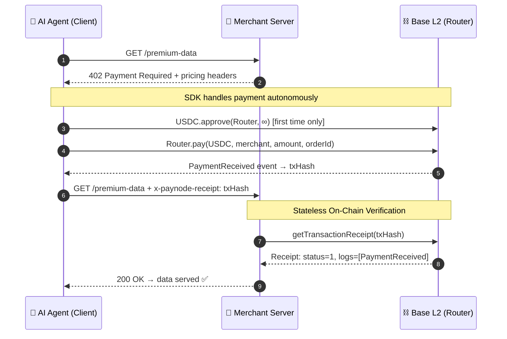

# The x402 Protocol

The core of PayNode is an extension of the HTTP `402 Payment Required` status code. We call this implementation **x402**.

The protocol defines a standardized handshake between a **Merchant Server** (API provider) and an **AI Agent** (Client).

---

## 🤝 The Handshake Flow



### 1. The Challenge (Server → Agent)

When an Agent requests a protected resource without prior payment, the server responds with HTTP `402` and includes pricing metadata in headers:

```http
HTTP/1.1 402 Payment Required
x-paynode-contract: 0x4A73696ccF76E7381b044cB95127B3784369Ed63
x-paynode-merchant: 0xMerchantWallet...
x-paynode-amount: 100000  # 100,000 units = 0.10 USDC (Smallest unit)
x-paynode-currency: USDC
x-paynode-token-address: 0x833589fCD6eDb6E08f4c7C32D4f71b54bdA02913
x-paynode-chain-id: 8453
x-paynode-order-id: agent_js_1716000000
```

> **Important**: `x-paynode-amount` always uses the token's **smallest unit** (atomic unit). For USDC (6 decimals), `100,000` represents **$0.10**. This ensures the Agent SDK can directly pass the value to the smart contract without additional chain queries for decimals.


### 2. The Execution (Agent On-Chain)

The SDK intercepts the `402`, reads the headers, and:

1. Checks balance and allowance
2. Calls `Router.pay(token, merchant, amount, orderId)` on Base L2
3. Waits for confirmation (~2 seconds)

> **Alternative**: Use `payWithPermit()` for single-transaction payments without prior `approve()`.

### 3. The Proof (Agent → Server)

Once mined, the Agent retries the original request with the transaction hash:

```http
GET /premium-data HTTP/1.1
x-paynode-receipt: 0x7249d5255d916c9bd0c2eed128e850d1950d76f571c576048f6cd03c8c2e83da
x-paynode-order-id: agent_js_1716000000
```

### 4. Stateless Verification (Server)

The merchant's `PayNodeVerifier` (built into the middleware) queries the chain:

1. ✅ Does the txHash exist and is status `1`?
2. ✅ Did it target the official PayNode Router contract?
3. ✅ Was the correct merchant address in the `PaymentReceived` event?
4. ✅ Was the amount ≥ required price?
5. ✅ Is the token in the [accepted whitelist](/integration#token-whitelist)?
6. ✅ Is the chainId correct? (cross-chain replay protection)
7. ✅ Has this txHash been used before? (idempotency check)

If all checks pass → `200 OK`. No database needed.

---

## 🛡️ Security Considerations

### Replay Attacks

The SDK includes `IdempotencyStore` (in-memory or Redis) to track consumed txHashes. A hash is only valid once within a configurable TTL (default: 24 hours).

### Fake Token Attacks

The `PayNodeVerifier` includes a built-in [Token Whitelist](/integration#token-whitelist) that rejects non-approved ERC20 addresses — preventing attackers from deploying fake USDC contracts.

### Cross-Chain Replay

The `PaymentReceived` event includes `chainId`. The Verifier checks that the chainId matches the expected network.

### RPC Reliability

- **JS SDK**: Supports `FallbackProvider` with multiple RPC URLs for automatic failover
- **Python SDK**: Configurable timeout and retry strategies
- **Production**: Always use private RPCs (Alchemy, Infura) — public RPCs rate-limit heavily
