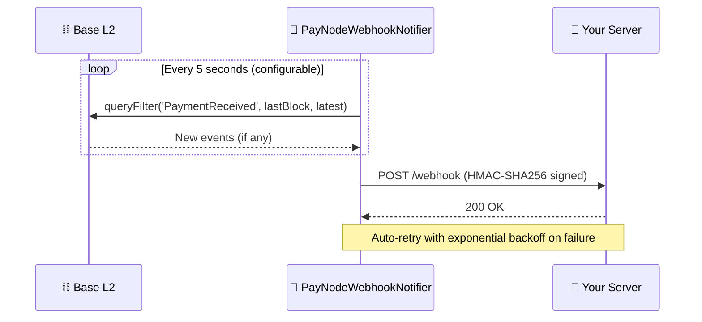

# Webhooks — Real-Time Payment Notifications

PayNode Webhook Notifiers monitor on-chain `PaymentReceived` events and deliver structured HTTP POST notifications to your endpoint, so you don't need to poll.

---

## How It Works



---

## JavaScript Setup

```typescript
import { PayNodeWebhookNotifier } from '@paynodelabs/sdk-js';

const notifier = new PayNodeWebhookNotifier({
  rpcUrl: 'https://mainnet.base.org',
  contractAddress: '0x4A73696ccF76E7381b044cB95127B3784369Ed63',
  webhookUrl: 'https://your-server.com/api/paynode-webhook',
  webhookSecret: process.env.WEBHOOK_SECRET,  // For HMAC signature
  chainId: 8453,
  pollIntervalMs: 5000,                        // Default: 5 seconds
  onSuccess: (event) => console.log(`Payment received: ${event.txHash}`),
  onError: (err, event) => console.error(`Delivery failed: ${err.message}`),
});

// Start listening
await notifier.start();

// Stop when shutting down
notifier.stop();
```

## Python Setup

```python
from paynode_sdk import PayNodeWebhookNotifier

notifier = PayNodeWebhookNotifier(
    rpc_url="https://mainnet.base.org",
    contract_address="0x4A73696ccF76E7381b044cB95127B3784369Ed63",
    webhook_url="https://your-server.com/api/paynode-webhook",
    webhook_secret=os.getenv("WEBHOOK_SECRET"),
    chain_id=8453,
    poll_interval_seconds=5.0,
    on_success=lambda e: print(f"Payment: {e.tx_hash}"),
    on_error=lambda e, ev: print(f"Failed: {e}"),
)

# Start listening (async)
await notifier.start()

# Stop
await notifier.stop()
```

---

## Webhook Payload

Every webhook POST contains a JSON body with the following structure:

```json
{
  "event": "payment.received",
  "data": {
    "txHash": "0xabc123...",
    "blockNumber": 12345678,
    "orderId": "0x7f83b1657ff1fc53b92dc...",
    "merchant": "0xMerchantAddress...",
    "payer": "0xPayerAddress...",
    "token": "0x833589fCD6eDb6E08f4c7C32D4f71b54bdA02913",
    "amount": "1000000",
    "fee": "10000",
    "chainId": "8453",
    "timestamp": 1716000000
  }
}
```

---

## Signature Verification

Every webhook request includes an HMAC-SHA256 signature in the `X-402-Signature` header. **You MUST verify this signature** to prevent spoofed webhook calls.

### Node.js Verification

```javascript
import crypto from 'crypto';

app.post('/api/paynode-webhook', (req, res) => {
  const payload = JSON.stringify(req.body);
  const signature = req.headers['X-402-Signature'];
  
  const expected = `sha256=${
    crypto.createHmac('sha256', process.env.WEBHOOK_SECRET)
      .update(payload)
      .digest('hex')
  }`;
  
  if (signature !== expected) {
    return res.status(401).json({ error: 'Invalid signature' });
  }
  
  // ✅ Verified — process the event
  const { data } = req.body;
  console.log(`Payment ${data.txHash} received: ${data.amount} from ${data.payer}`);
  res.status(200).json({ received: true });
});
```

### Python Verification

```python
import hmac, hashlib, json

@app.post("/api/paynode-webhook")
async def webhook(request: Request):
    body = await request.body()
    signature = request.headers.get("X-402-Signature", "")
    
    expected = "sha256=" + hmac.new(
        WEBHOOK_SECRET.encode(), body, hashlib.sha256
    ).hexdigest()
    
    if not hmac.compare_digest(signature, expected):
        return JSONResponse(status_code=401, content={"error": "Invalid signature"})
    
    # ✅ Verified
    data = json.loads(body)["data"]
    print(f"Payment {data['txHash']}: {data['amount']} from {data['payer']}")
    return {"received": True}
```

---

## Headers

| Header | Description |
| :--- | :--- |
| `X-402-Signature` | `sha256={hmac_hex}` — HMAC-SHA256 of the JSON body |
| `x-paynode-event` | Event type (currently: `payment.received`) |
| `x-paynode-delivery-id` | `{txHash}-{attempt}` — unique delivery ID for deduplication |
| `Content-Type` | `application/json` |

## Retry Policy

| Attempt | Backoff Delay |
| :--- | :--- |
| 1st attempt | Immediate |
| 2nd attempt | 2 seconds |
| 3rd attempt | 4 seconds |
| 4th attempt | 8 seconds |
| After 3 retries | `onError` callback is invoked |

Your endpoint should return `2xx` to acknowledge receipt. Any `4xx`/`5xx` response triggers a retry.
