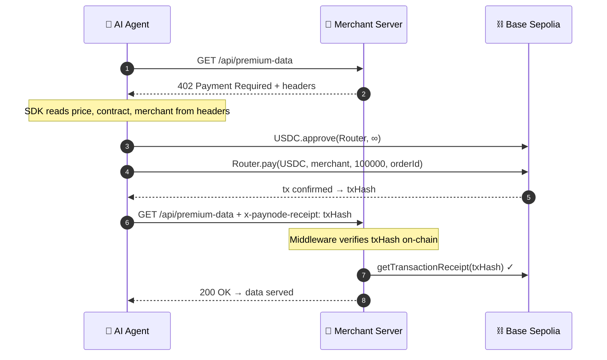

# ⚡ Quickstart — 5 Minutes to Your First Agent Payment

This guide walks you through setting up a **Merchant Server** that charges AI Agents $0.10 USDC per request, and an **Agent Client** that autonomously pays for it. All on Base Sepolia testnet.

> **Prerequisites**
> - Node.js 18+ and npm
> - A wallet with Base Sepolia ETH ([Alchemy Faucet](https://www.alchemy.com/faucets/base-sepolia))
> - Testnet Mock USDC (see [Contracts page](/contracts) for mint instructions)

---

## Step 1: Create the Merchant Server (2 min)

```bash
mkdir paynode-merchant && cd paynode-merchant
npm init -y
npm install express @paynodelabs/sdk-js ethers
```

Create `server.js`:

```javascript
const express = require('express');
const { x402_gate } = require('@paynodelabs/sdk-js');

const app = express();

// Protect this route — charge $0.10 USDC per request
app.get('/api/premium-data', x402_gate({
  rpcUrls: ['https://sepolia.base.org'],
  chainId: 84532,
  contractAddress: '0xB587Bc36aaCf65962eCd6Ba59e2DA76f2f575408',  // Sepolia Router
  merchantAddress: '0xYOUR_WALLET_ADDRESS',                        // ← Replace with your wallet
  tokenAddress: '0xeAC1f2C7099CdaFfB91Aa3b8Ffd653Ef16935798',    // Sepolia USDC
  currency: 'USDC',
  price: '0.10',
  decimals: 6,
}), (req, res) => {
  // 🎉 This code ONLY runs after verified on-chain payment
  res.json({
    success: true,
    data: 'The answer to everything is 42.',
    receipt: req.paynode.receiptHash,
  });
});

app.listen(3000, () => {
  console.log('🏪 Merchant server running on http://localhost:3000');
  console.log('   Try: curl http://localhost:3000/api/premium-data');
  console.log('   Expected: 402 Payment Required');
});
```

```bash
node server.js
```

---

## Step 2: Create the Agent Client (2 min)

In a new terminal:

```bash
mkdir paynode-agent && cd paynode-agent
npm init -y
npm install @paynodelabs/sdk-js ethers
```

Create `agent.js`:

```javascript
const { PayNodeAgentClient } = require('@paynodelabs/sdk-js');

const AGENT_PRIVATE_KEY = process.env.AGENT_PRIVATE_KEY; // Must have Base Sepolia ETH + USDC
const RPC_URL = 'https://sepolia.base.org';

async function main() {
  const agent = new PayNodeAgentClient(AGENT_PRIVATE_KEY, RPC_URL);

  console.log('🤖 Agent requesting premium data...');
  const response = await agent.requestGate('http://localhost:3000/api/premium-data');

  if (response.ok) {
    const data = await response.json();
    console.log('✅ Data received:', data);
  } else {
    console.log('❌ Request failed:', response.status);
  }
}

main().catch(console.error);
```

```bash
AGENT_PRIVATE_KEY=0xYOUR_TESTNET_KEY node agent.js
```

You should see:

```
🤖 Agent requesting premium data...
💡 [PayNode-JS] 402 Payment Required detected. Handling autonomous payment...
🔐 [PayNode-JS] Allowance too low. Granting Infinite Approval...
🔓 [PayNode-JS] Infinite Approval confirmed.
✅ [PayNode-JS] Payment confirmed on-chain: 0xabc123...
✅ Data received: { success: true, data: 'The answer to everything is 42.', receipt: '0xabc123...' }
```

---

## Step 3: Verify (1 min)

1. Copy the `receipt` hash from the output.
2. Search it on [Sepolia Basescan](https://sepolia.basescan.org).
3. You'll see the `PaymentReceived` event — 99% to your merchant wallet, 1% to protocol treasury.

**Congratulations!** 🎉 You just built a Machine-to-Machine payment system. The Agent paid $0.10 to access your API, all verified on-chain with zero databases.

---

## What Just Happened?



## Next Steps

- **Go to Mainnet**: Switch `chainId` to `8453` and use real [contract addresses](/contracts)
- **Add Permit**: Use `signPermit()` + `payWithPermit()` for single-tx gasless payments → [JS SDK](/sdk-js)
- **Receive Webhooks**: Get notified when payments arrive → [Webhooks](/webhooks)
- **Token Whitelist**: Secure your verifier against fake tokens → [Security](/sdk-js#token-whitelist)
- **Error Handling**: Debug any issues → [Error Codes](/error-codes)
